<h1 align="center">
  <br>
  <code>&lt;google-map&gt;</code>
  <br>
</h1>

<p align="center">
  <b>Google Maps as a Web Component.</b><br>
  One tag. Zero config. Full power.
</p>

<p align="center">
  <a href="https://www.npmjs.com/package/google-map-extension"></a>
  <a href="LICENSE"></a>
</p>

<p align="center">
  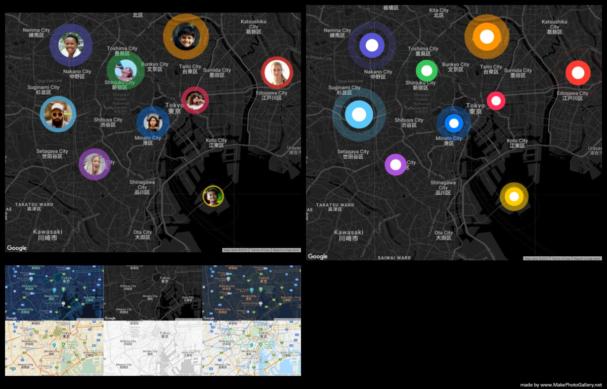
</p>

<br>

## What is this?

A single Custom Element that wraps the Google Maps JavaScript API.
No boilerplate. No framework lock-in. Just drop a tag and go.

```html
<google-map zoom="12" center="35.658584,139.7454316" theme="dark"></google-map>
```

That's a fully interactive dark-themed map. Really.

<br>

## Highlights

| | |
|---|---|
| **One tag, full map** | Works out of the box &mdash; zero config needed |
| **6 built-in themes** | standard, silver, retro, dark, night, aubergine |
| **Markers that pop** | Circles, images, and rich HTML balloons |
| **Geocoding baked in** | Address &harr; coordinates in a single call |
| **Distance math** | Meters between any two points on Earth |

<br>

## Getting Started

### Install

```sh
npm install google-map-extension
```

### Minimal Setup

```html
<google-map
  zoom="12"
  center="35.658584,139.7454316"
  type="roadmap"
  theme="dark"
  zoom-control
  streetview-control
  fullscreen-control
  theme-control></google-map>

<script src="https://maps.googleapis.com/maps/api/js?key=YOUR_API_KEY"></script>
<script type="module">
  import 'google-map-extension';
</script>
```

That's it. You have a dark-themed, fully interactive map with controls.

<br>

## Usage

### React to clicks

```js
const map = document.querySelector('#map');

map.on('click.map', event => {
  const position = event.detail;
  map.moveToPosition(position);
});
```

### Drop a circle marker

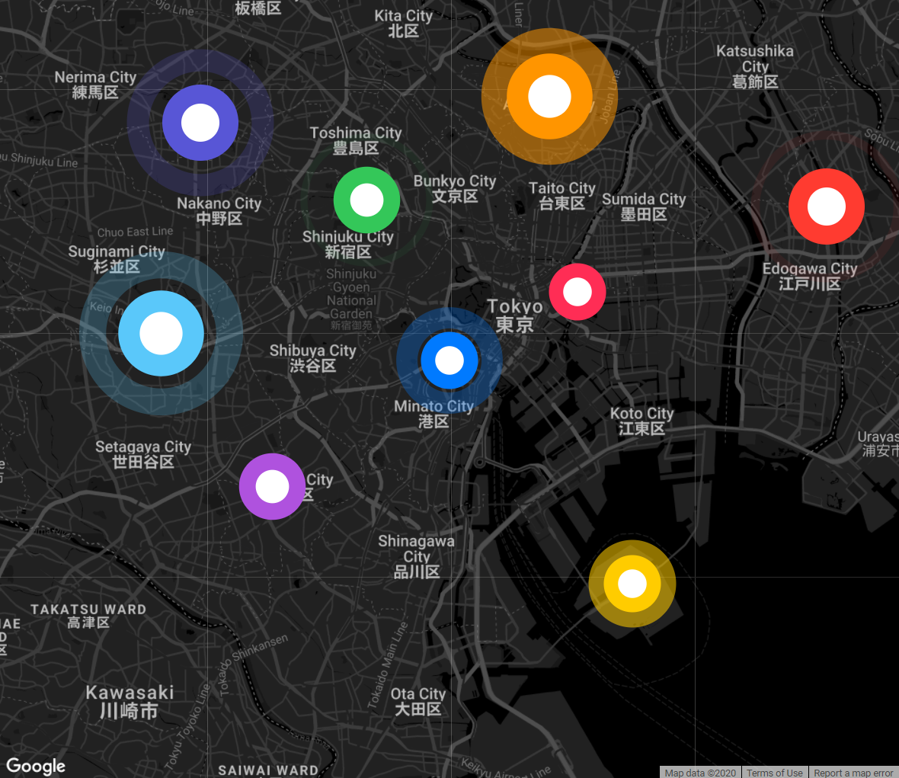

```js
const marker = await map.addMarker({
  color: 'rgb(0,122,255)',
  size: 60,
  position: { lat: 35.650584, lng: 139.7454316 }
});
```

### Use your own image

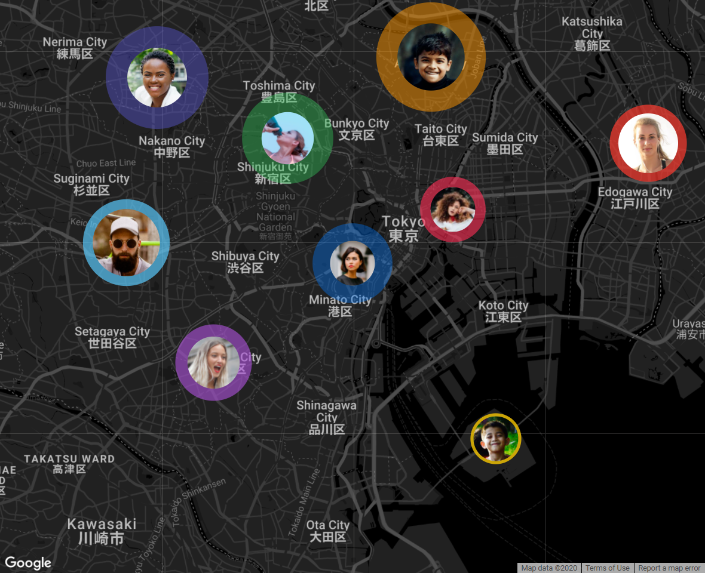

```js
const marker = await map.addMarker({
  image: 'avatar.png',
  color: 'rgb(0,122,255)',
  size: 60,
  position: { lat: 35.650584, lng: 139.7454316 }
});
```

### Attach a balloon

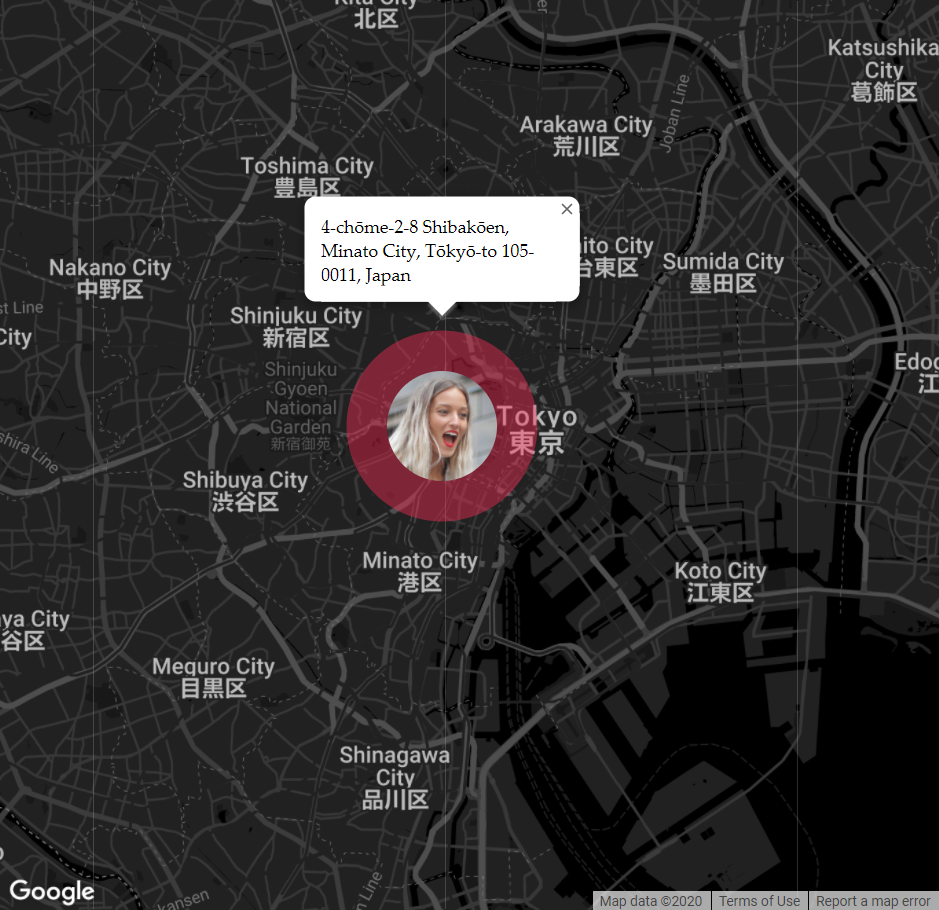

```js
const marker = await map.addMarker({
  position: { lat: 35.650584, lng: 139.7454316 },
  info: '<strong>Hello!</strong>'
});
```

### Move & remove

```js
marker.moveToPosition({ lat: 35.660584, lng: 139.7554316 });

map.removeMarker(marker);
```

### Geocoding & distance

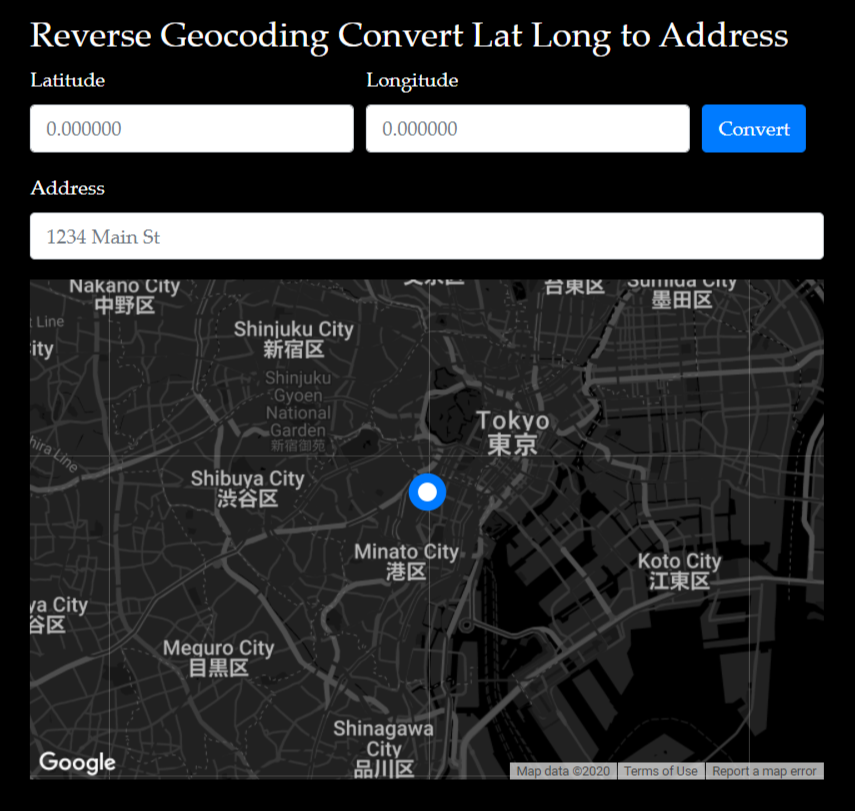

```js
import { GoogleMapUtils } from 'google-map-extension';

// Address -> coordinates
const latlng = await GoogleMapUtils.getLatLngFromAddress('Tokyo Tower, Japan');
// => { lat: 35.6585..., lng: 139.7454... }

// Coordinates -> address
const address = await GoogleMapUtils.getAddressFromLatLng({ lat: 35.6585, lng: 139.7454 });

// Distance in meters (requires libraries=geometry)
const meters = GoogleMapUtils.computeDistanceBetween(
  { lat: 35.6581, lng: 139.7414 },
  { lat: 35.6706, lng: 139.7672 }
);
```

<br>

## API Reference

### `<google-map>` Element

#### Attributes

| Attribute | Type | Default | Description |
|---|---|---|---|
| `zoom` | `number` | `13` | Zoom level, 1 (world) &ndash; 21 (building) |
| `center` | `string` | `"0,0"` | Starting position &mdash; `"lat,lng"` |
| `type` | `string` | `"roadmap"` | `roadmap` / `satellite` / `hybrid` / `terrain` |
| `theme` | `string` | `"standard"` | `standard` / `silver` / `retro` / `dark` / `night` / `aubergine` |
| `zoom-control` | `boolean` | &mdash; | Show zoom buttons |
| `streetview-control` | `boolean` | &mdash; | Show Street View pegman |
| `fullscreen-control` | `boolean` | &mdash; | Show fullscreen toggle |
| `theme-control` | `boolean` | &mdash; | Show theme picker |

##### Zoom level previews

<table>
  <tr><th>Level</th><th>Preview</th><th>Level</th><th>Preview</th><th>Level</th><th>Preview</th></tr>
  <tr><td>1</td><td>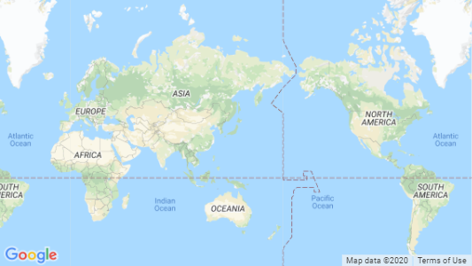</td><td>8</td><td>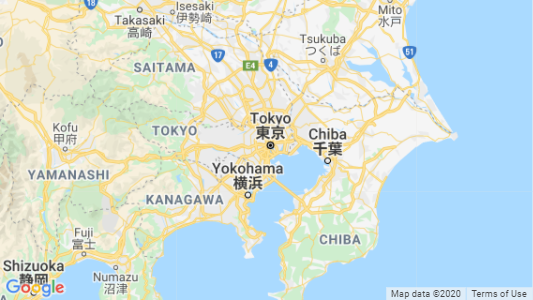</td><td>15</td><td>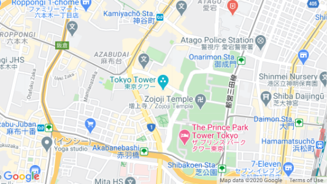</td></tr>
  <tr><td>2</td><td>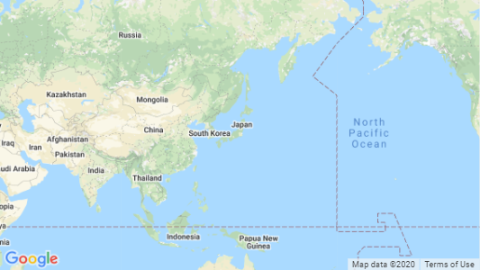</td><td>9</td><td>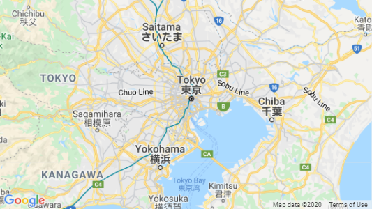</td><td>16</td><td>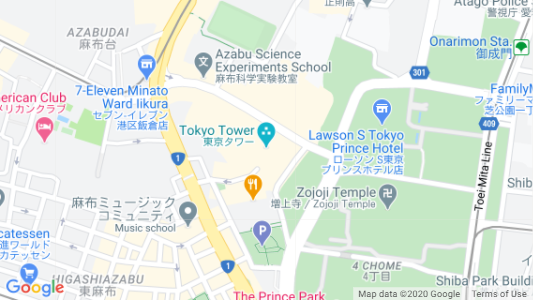</td></tr>
  <tr><td>3</td><td>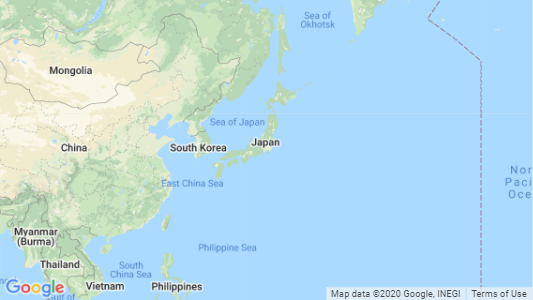</td><td>10</td><td>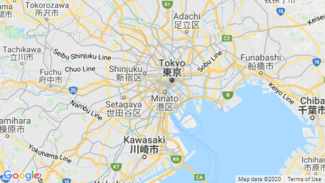</td><td>17</td><td></td></tr>
  <tr><td>4</td><td>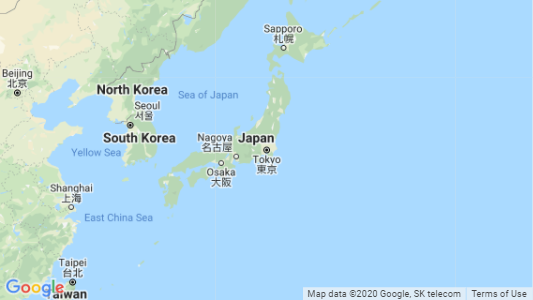</td><td>11</td><td>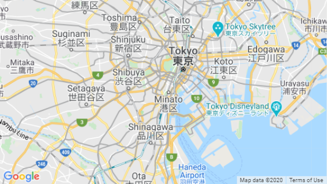</td><td>18</td><td>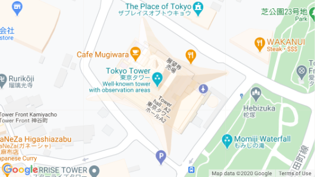</td></tr>
  <tr><td>5</td><td>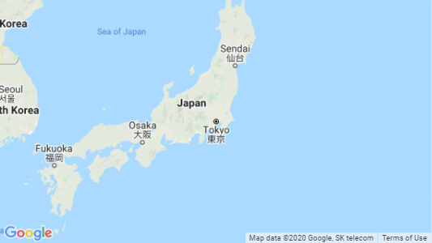</td><td>12</td><td>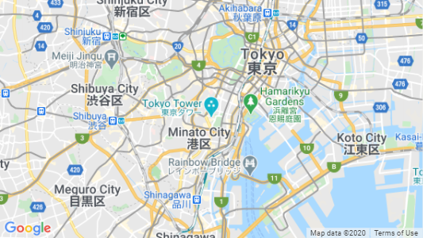</td><td>19</td><td>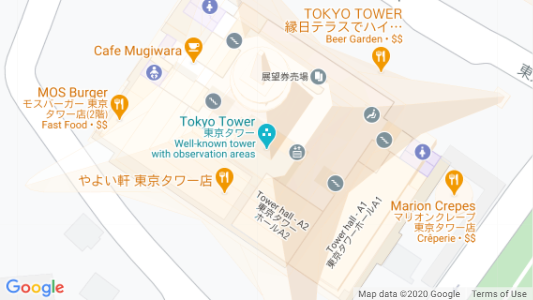</td></tr>
  <tr><td>6</td><td>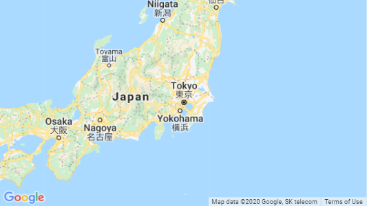</td><td>13</td><td>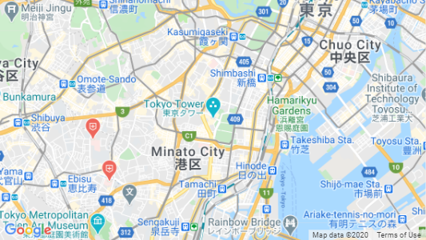</td><td>20</td><td>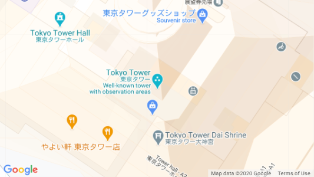</td></tr>
  <tr><td>7</td><td>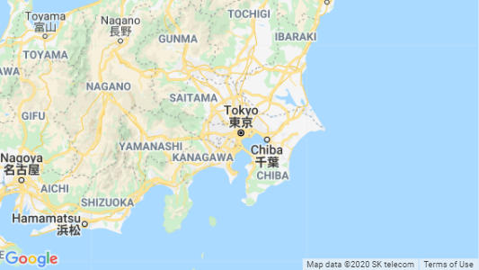</td><td>14</td><td>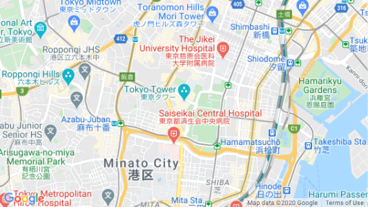</td><td>21</td><td>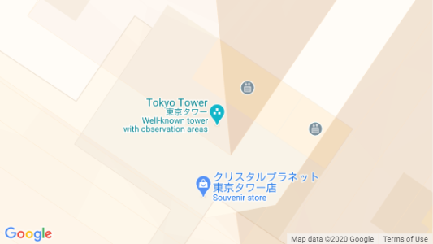</td></tr>
</table>

##### Map type previews

| Type | What you get | Preview |
|---|---|---|
| `roadmap` | Classic road map | 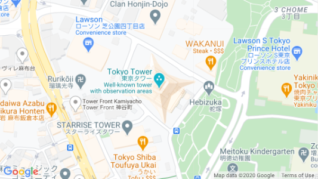 |
| `satellite` | Google Earth imagery | 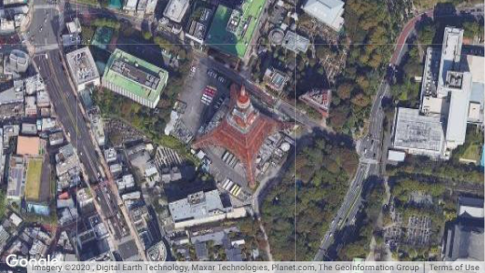 |
| `hybrid` | Satellite + road labels | 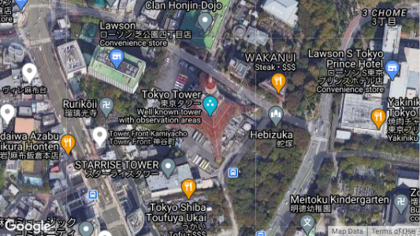 |
| `terrain` | Elevation & terrain | 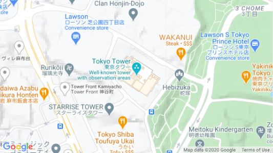 |

##### Theme previews

| Theme | Preview |
|---|---|
| `standard` | 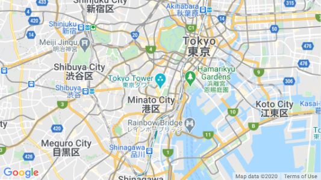 |
| `silver` | 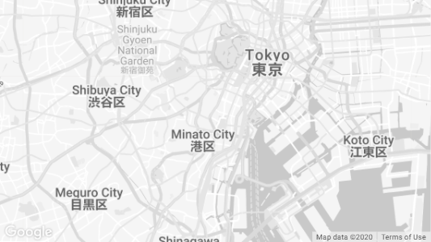 |
| `retro` | 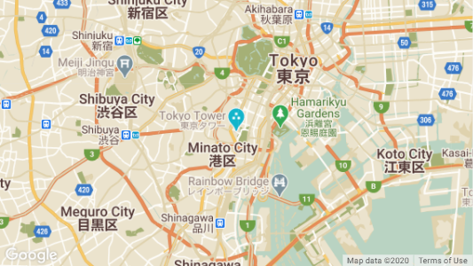 |
| `dark` | 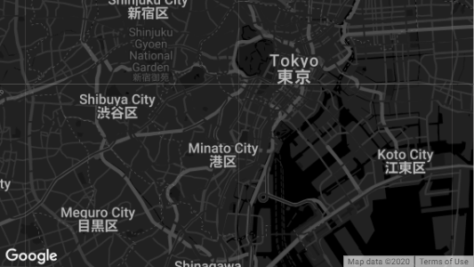 |
| `night` | 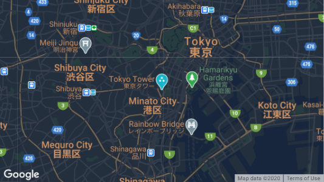 |
| `aubergine` | 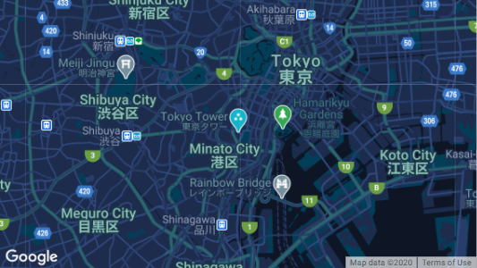 |

<br>

#### Events

##### `click.map`

Fires on map click. The tapped coordinates come through `event.detail`.

```js
map.on('click.map', event => {
  const position = event.detail; // { lat, lng }
});
```

<br>

#### Properties

| Property | Type | Description |
|---|---|---|
| `map` | `google.maps.Map` | Raw [Maps JavaScript API](https://developers.google.com/maps/documentation/javascript/reference/map) instance &mdash; full power when you need it |

<br>

#### Methods

##### `addMarker(option?)`

Drop a marker on the map.

```ts
map.addMarker(option?: {
  position?: { lat: number, lng: number },
  size?: number,
  visible?: boolean,
  image?: string,
  color?: string,
  info?: string
}): Promise<GoogleMapCircleMarker>
```

| Parameter | Type | Default | Description |
|---|---|---|---|
| `position` | `{ lat, lng }` | Map center | Where to place the marker |
| `size` | `number` | `50` | Diameter in pixels |
| `visible` | `boolean` | `true` | Show on creation |
| `image` | `string` | &mdash; | Image URL inside the marker |
| `color` | `string` | `"rgb(0,122,255)"` | Fill color |
| `info` | `string` | &mdash; | Balloon content (HTML ok) |

Returns `Promise<GoogleMapCircleMarker>`

##### `removeMarker(marker)`

Remove a marker from the map.

```ts
map.removeMarker(marker: GoogleMapCircleMarker): GoogleMap
```

##### `moveToPosition(latlng, zoomToCurrentPosition?)`

Pan the map to a new location.

```ts
map.moveToPosition(
  latlng: google.maps.LatLng | google.maps.LatLngLiteral,
  zoomToCurrentPosition?: boolean  // default: true
): GoogleMap
```

##### `zoomToFitAllPositions(positions)`

Auto-zoom to fit every marker or coordinate in view.

```ts
map.zoomToFitAllPositions(
  positions: google.maps.LatLng[] |
             google.maps.LatLngLiteral[] |
             google.maps.Marker[] |
             GoogleMapCircleMarker[]
): GoogleMap
```

<br>

### `GoogleMapCircleMarker`

The marker object returned by `addMarker()`.

#### Methods

##### `moveToPosition(latlng, zoomToCurrentPosition?)`

Slide the marker to a new spot.

```ts
marker.moveToPosition(
  latlng: google.maps.LatLng | google.maps.LatLngLiteral,
  zoomToCurrentPosition?: boolean  // default: true
): GoogleMapCircleMarker
```

##### `getPosition()`

Get the marker's current coordinates.

```ts
marker.getPosition(): google.maps.LatLngLiteral
```

##### `setVisible(visible)`

Show or hide the marker.

```ts
marker.setVisible(visible: boolean): GoogleMapCircleMarker
```

##### `setInfo(content)`

Set the balloon content. HTML is supported.

```ts
marker.setInfo(content: string): GoogleMapCircleMarker
```

##### `clearInfo()`

Dismiss the balloon.

```ts
marker.clearInfo(): GoogleMapCircleMarker
```

<br>

### `GoogleMapUtils`

Standalone helpers &mdash; no map instance required.

```js
import { GoogleMapUtils } from 'google-map-extension';
```

#### Methods

##### `getCurrentPosition(option?)`

Grab the device's current location.

```ts
GoogleMapUtils.getCurrentPosition(option?: {
  timeout?: number,    // ms, default: 5000
  maximumAge?: number  // ms, default: 0
}): Promise<google.maps.LatLngLiteral>
```

##### `getLatLngFromAddress(address)`

Turn an address into coordinates.

```ts
GoogleMapUtils.getLatLngFromAddress(address: string): Promise<google.maps.LatLngLiteral>
```

##### `getAddressFromLatLng(latlng)`

Turn coordinates into an address.

```ts
GoogleMapUtils.getAddressFromLatLng(
  latlng: google.maps.LatLng | google.maps.LatLngLiteral
): Promise<string | undefined>
```

##### `computeDistanceBetween(from, to)`

Meters between two points on the globe.

> Requires `libraries=geometry` in your API script tag.

```ts
GoogleMapUtils.computeDistanceBetween(
  from: google.maps.LatLng | google.maps.LatLngLiteral,
  to: google.maps.LatLng | google.maps.LatLngLiteral
): number
```

<br>

## Examples

Working demos are in the [examples/](./examples) directory.

## License

[MIT](./LICENSE)
